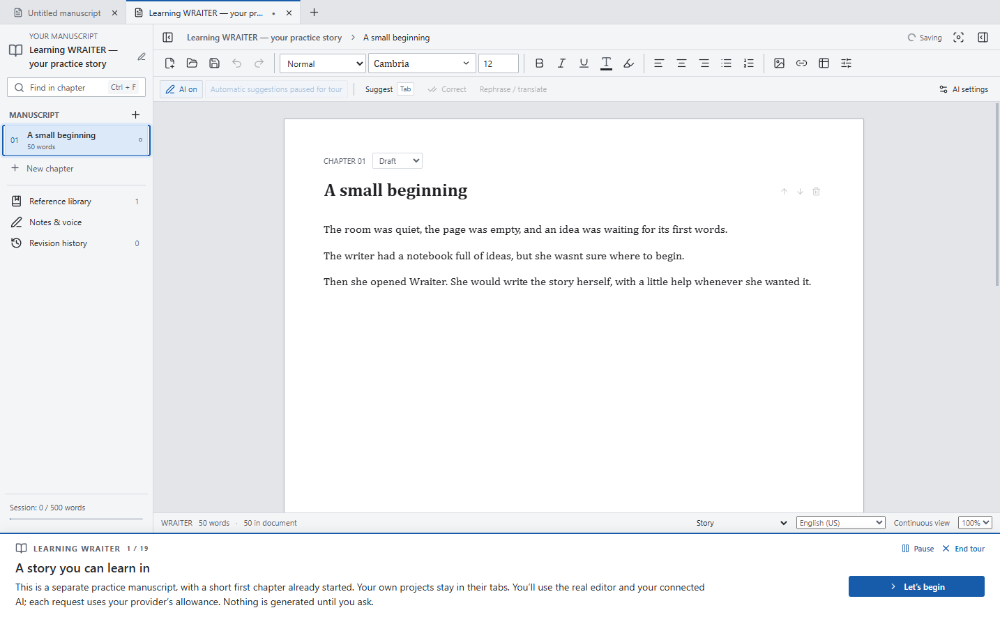

# WRAITER

**A writing app with AI help, whenever you want it.**

Write your story, organise it into chapters, and get help finishing a sentence or finding the right word. WRAITER brings your AI connection into the manuscript, so you can keep writing in one place.

You do not need to know how to code. A guided setup helps you connect **Codex** or **Claude Code**, and a hands-on tutorial teaches you inside a practice story.

## Download WRAITER

**[Download the Windows installer](https://github.com/LEC1224/WRAITER/releases/download/v0.9.0/WRAITER-0.9.0-Setup.exe)** · [All downloads and release notes](https://github.com/LEC1224/WRAITER/releases/latest)

Version **0.9.0** is the first public release. It is an early preview for **Windows 10/11 on a 64-bit Intel or AMD computer**. macOS, Linux and Windows on ARM are not yet supported release targets.

| Choose a download | Who it is for |
| --- | --- |
| **[Installer — recommended](https://github.com/LEC1224/WRAITER/releases/download/v0.9.0/WRAITER-0.9.0-Setup.exe)** | Guides you through installation, lets you choose a folder, and adds shortcuts. |
| [Portable app](https://github.com/LEC1224/WRAITER/releases/download/v0.9.0/WRAITER-0.9.0-Windows.exe) | Runs without installing WRAITER. Settings and recovery files still stay in your Windows user profile. |

Download one of these `.exe` files. GitHub's **Source code** downloads are for developers; they are not the installer.

The preview is **not digitally signed**, so Windows may display an unknown-publisher or reputation warning. Release files are published only under [LEC1224/WRAITER](https://github.com/LEC1224/WRAITER/releases); checksums are included for people who want to verify their download.

WRAITER is free under the MIT license. An eligible Codex or Claude Code account is separate, and AI requests use that provider's allowance or billing. Internet access is needed to connect those services. You can also write with AI turned off, or use a local AI model through the advanced settings.

## Your first few minutes

1. **Install and open WRAITER.** Choose **Simple** for the recommended setup. **Advanced** also lets you choose the AI model, helper application and automatic-suggestion behaviour. Both let you choose where WRAITER is installed.
2. **Choose Codex or Claude Code.** The guide checks whether its helper application is installed and offers to install it if needed.
3. **Sign in with your provider.** Follow its sign-in prompts, return to WRAITER, and check the connection. WRAITER does not ask for your account password.
4. **Try the short writing test.** It checks that your AI can respond before calling the connection ready. This sends a sample sentence and uses a small amount of your provider's allowance.
5. **Start the writing tutorial.** Practise in a separate manuscript, then start your own story or open an existing document.

Already want to write? Choose **Set up later**. You can return through **Help → Set up AI**.

## Learn by writing



The tutorial opens a short story that has already begun. You create its next chapter, and WRAITER adds an opening for you to continue. Press **Tab** and your connected AI suggests what could happen next.

The guide stays beneath the workspace and highlights the controls you are learning. You use the real editor and real AI, including selecting a word for alternatives, trying correction, and asking the assistant to help with an edit. AI exercises use your provider's normal allowance; nothing is generated until you ask during the tour.

You will also explore chapters, undo and redo, notes, references, history, finding text, saving and exporting. Pause whenever you like. Your own projects stay in their tabs. Revisit the walkthrough through **Help → Writing tutorial**.

| While writing | Try this default shortcut |
| --- | --- |
| Ask for the next part of a sentence | **Tab** at the cursor |
| Accept the whole suggestion | **Tab** again |
| Accept just the next suggested word | **Ctrl + Right arrow** |
| Accept one suggested character | **Right arrow** |
| Dismiss a suggestion or cancel a request | **Esc** |
| Find another way to say something | Select text, then **Tab** |
| Choose a suggested alternative | **Up / Down**, then **Enter** or **Tab** |
| Undo the last change | **Ctrl + Z** |
| Save | **Ctrl + S** |

Shortcuts can be changed in **Settings → Keyboard shortcuts**. The tutorial follows your current bindings.

## What you can do

- **Keep your writing organised.** Work with chapters and several manuscripts in tabs, with word counts, focus mode, themes and familiar formatting.
- **Stay in control of AI suggestions.** Preview completions and rewritten selections before accepting them. Direct editing requests in the assistant panel apply an undoable batch of changes.
- **Give AI useful background.** Share writing-voice instructions and selected reference files. Keep private notes for yourself.
- **Keep editing history.** Undo and redo survive restarts. Recovery saves and preceding-save backups help protect your work. Optional named checkpoints are available when Git is installed.
- **Use familiar documents.** Open and save WRAITER, Word (`.docx`), LibreOffice (`.odt`), plain text, Markdown and HTML files. Export PDF, EPUB, office documents or text for publishing and sharing.
- **Choose your AI.** Start with Codex or Claude Code; advanced connections include local models, Ollama, OpenAI and Claude APIs, and compatible services. Different writing tasks can use different models.

### Your writing and privacy

Manuscripts and recovery files are stored on your computer. When you request cloud AI help, WRAITER sends the text needed for that task, along with enabled references and writing-voice instructions, to your selected provider. The writing assistant can read relevant manuscript passages to answer an editing request. **Private notes are excluded from AI requests and exports.**

API keys, when used, are encrypted in your Windows user profile and are not saved in manuscripts. Your provider's own terms and data handling still apply. Local inference can work offline after its engine and model have been downloaded. Local recovery is not a cloud backup: keep a separate backup of important writing.

### A few preview limitations

Complex Word or LibreOffice features, such as tracked changes, footnotes, headers and advanced page layouts, may be simplified or omitted. Review the compatibility notice when opening those documents, and keep your originals. The editing page view is not an exact preview of every export layout.

Codex has been tested with real writing requests. Claude Code integration has automated coverage, but a live Claude Code response and installation/sign-in on a completely fresh PC still need wider testing. AI availability and output depend on your account and chosen model.

## Help, ideas and feedback

Read the **[user guide](docs/USER-GUIDE.md)** for more detail, or **[troubleshooting](docs/TROUBLESHOOTING.md)** if setup gets stuck.

**[Ask for help or report a problem](https://github.com/LEC1224/WRAITER/issues/new/choose)** · **[Suggest an improvement](https://github.com/LEC1224/WRAITER/issues/new?template=feature_request.yml)**

You do not have to be a programmer to help. Tell us where an instruction was confusing, which step you expected next, or what got in the way of writing. Screenshots with sample text are welcome. GitHub issues are public, so please leave out private manuscripts, account details and keys.

---

## For contributors

Contributions are welcome, including clearer wording, accessibility improvements, Windows testing, documentation and code. The priority is a writing experience that someone without technical knowledge can understand and trust.

See **[CONTRIBUTING.md](CONTRIBUTING.md)** for the workflow, test guidance and suggested areas to help. For a larger change, open an issue first so we can agree on the user experience and scope.

### Run from source

Use **Node.js 24 LTS**, npm and Git on Windows. Dependency versions are recorded in `package-lock.json`.

```powershell
git clone https://github.com/LEC1224/WRAITER.git
cd WRAITER
npm ci
npm run build
npm start
```

Rebuild after changing the renderer. `npm run dev` serves the browser UI only; native files, menus and AI connections require the Electron application. Source builds normally use WRAITER's regular application data. For a separate development profile, set `$env:WRAITER_USER_DATA` to an absolute scratch-folder path before `npm start`.

### How the application fits together

| Location | Responsibility |
| --- | --- |
| `src/` | React interface, TipTap editor, inline previews, walkthrough, formatting and exports |
| `electron/main.cjs`, `electron/preload.cjs` | Desktop lifecycle and the bridge between the interface and native operations |
| `electron/providers.cjs`, `electron/*-bridge.cjs` | AI requests, saved-account connections and provider responses |
| `electron/setup.cjs`, `build/installer.nsh` | AI setup and the assisted Windows installer |
| `electron/workspace-session.cjs`, `document-files.cjs`, `edit-journal.cjs` | Project tabs, native saves, recovery and persistent undo |
| `electron/writing-agent.cjs` | Bounded document tools and validated assistant edit batches |
| `src/tutorial.js`, `src/WritingWalkthrough.jsx` | Practice manuscript, lessons and progress driven by editor actions |
| `tests/` | Unit checks, synthetic document fixtures and Electron workflow tests |

The renderer uses an isolated preload bridge. AI edits are validated against the document state before application; the assistant's document tools cannot run shell commands or operate arbitrary files. Keep privacy boundaries and recovery behaviour intact when extending the app.

### Test and package

```powershell
npm test
npm run build
npm run test:onboarding
npm run test:tutorial
npm run test:settings
npm run package
```

Unit tests and these desktop suites use synthetic data and local test services. Run desktop suites sequentially. Packaging produces the Windows x64 installer and portable executable under `release/`. Desktop tests accept `WRAITER_EXECUTABLE` to exercise a packaged build.

**Live tests are opt-in:** `npm run test:tutorial:live` sends two requests through your saved Codex account and uses its allowance. It is not part of CI. See the contributor guide for local-model, PDF and office-format test prerequisites.

The [validation report](TEST-REPORT.md) records checks and remaining limitations for this release. [Release notes](docs/releases/v0.9.0.md) describe the first public version. CI runs unit tests and the frontend build on Windows; it does not sign executables or validate paid-provider accounts.

## License and acknowledgements

WRAITER is released under the **[MIT license](LICENSE)**. Its name and this repository do not imply endorsement by OpenAI, Anthropic or any other provider.

WRAITER uses Electron, React, TipTap/ProseMirror and other community projects. Their notices are collected in [THIRD-PARTY-NOTICES.md](THIRD-PARTY-NOTICES.md); the Windows distribution also includes Electron and Chromium notices. Optional AI helpers, runtimes and downloaded models retain their own licenses and terms.
